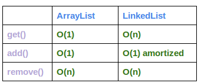

| Operation | Time Complexity |
| ----------- | ----------- |
| Insert a node (assume you already traverse to the target node)  | O(1) |
| Remove a node (assume you already traverse to the target node)| O(1) | 
| Find and then remove a node | O(n) |
| Find a node | O(n) |

Notice, single linked list is different from array in terms of their cost. A detailed diagram can be found here:

