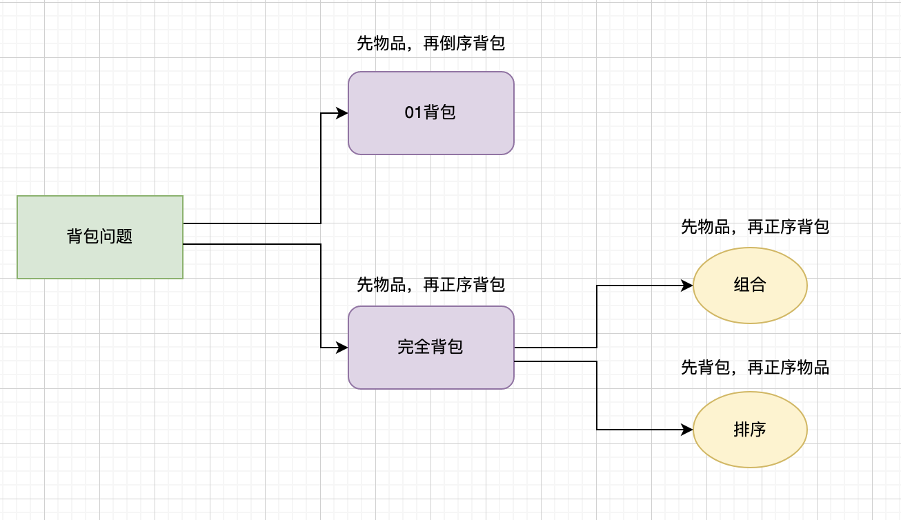

## 01背包问题 (Knapsack problem) - 1D
```python 3

def test_1_wei_bag_problem():
    weight = [1, 3, 4]
    value = [15, 20, 30]
    bag_weight = 4
    # 初始化: 全为0
    dp = [0] * (bag_weight + 1)

    # 先遍历物品, 再遍历背包容量 => 这个顺序很重要，不能换
    for i in range(len(weight)):
        for j in range(bag_weight, weight[i] - 1, -1):
            # 递归公式
            # 比起 2D 的数组相当于把 [i - 1] 删除了。做了一个直接拷贝的动作。
            dp[j] = max(dp[j], dp[j - weight[i]] + value[i])


    return dp[-1]
```

## 01背包问题 (Knapsack problem) - 2D
```python 3
def test_1_wei_bag_problem():
    def test_2_wei_bag_problem1(bag_size, weight, value):
    row = len(weight)
    col = bag_size + 1


    dp = [[0 for _ in range(col)] for _ in range(row)]
    
    # initialization
    for i in range(row):
        dp[i][0] = 0

    for j in range(1, col):
        if weight[0] <= j:
            dp[0][j] = value[0]
    
    # 先遍历物品
    for i in range(1, row):

        cur_weight = weight[i]
        cur_value = value[i]

        for j in range(1, col):
                
            if cur_weight > j:
                # 不放
                dp[i][j] = dp[i - 1][j]
            else:
                # 放 or 不放取最大的
                dp[i][j] = max(dp[i - 1][j - cur_weight] + cur_value, dp[i - 1][j])
    return dp[row - 1][col - 1]
```

## 完全背包问题 (Knapsack problem) - 1D 
# 物品可以拿多次
```python 3

def test_1_wei_bag_problem():
    weight = [1, 3, 4]
    value = [15, 20, 30]
    bag_weight = 4
    # 初始化: 全为0
    dp = [0] * (bag_weight + 1)

    # 先遍历物品, 再遍历背包容量 => 这个顺序很重要，不能换
    for i in range(len(weight)):
        for j in range(weight[i], bag_weight + 1):
            # 递归公式
            # 比起 2D 的数组相当于把 [i - 1] 删除了。做了一个直接拷贝的动作。
            dp[j] = max(dp[j], dp[j - weight[i]] + value[i])


    return dp[-1]
```

## 完全背包 - 1D - 组合
先物品，再背包
```python 
class Solution:
    def combination(self, amount: int, coins: List[int]) -> int:
        dp = [0] * (amount + 1)

        # index and its meaning 
        # i => amount, dp[i] => # of combo
        
        # initialization 
        dp[0] = 1
        # dp relation:
        # dp[j] += dp[j - coins[i]]
        
        # 先物品再背包

        for i in range(len(coins)):
            for j in range(coins[i], amount + 1):
                dp[j] += dp[j - coins[i]]


        return dp[amount]
```
## 完全背包 - 1D - 排列
先背包，再物品
```python 
class Solution:
    def permutation(self, nums: List[int], target: int) -> int:

        dp = [0] * (target + 1)

        # initializtaion 
        dp[0] = 1

        # how to traverse (order)
        # state transformation 

        # 先背包再物品
        
        for j in range(1, target + 1):
            for i in range(len(nums)):
                if j >= nums[i]:
                    dp[j] += dp[j - nums[i]] 


        return dp[target]
```


## 区间 dp
```python 3
def helper(self, ns: List[int]) :
    N = len(ns)
    dp = [[0] * N for _ in range(N+1)]
    for l in range(N): # 长度从小到大
        for i in range(N-l): # 以 i 为 开头
            j = i + l           # 以 j 为 终点
            for k in range(i,j): # 以 k 为分割点，进行分治         
                // Todo 业务逻辑 
# 例题可以参考力扣 673
```